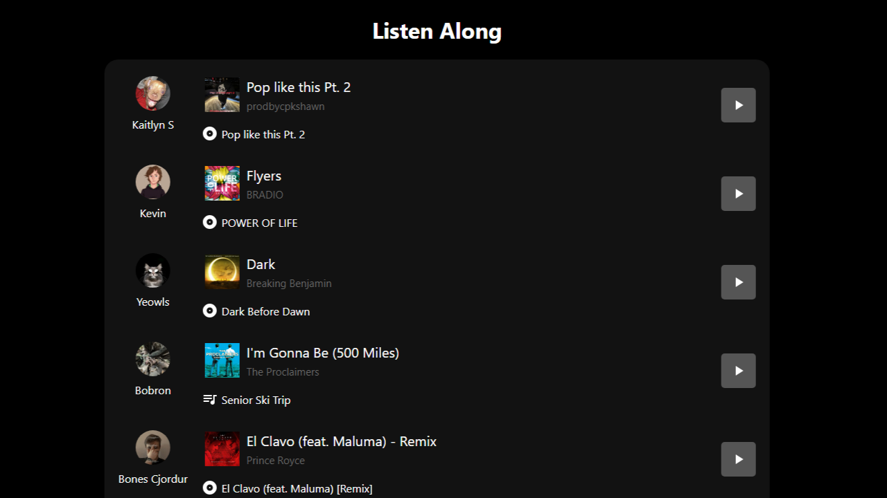
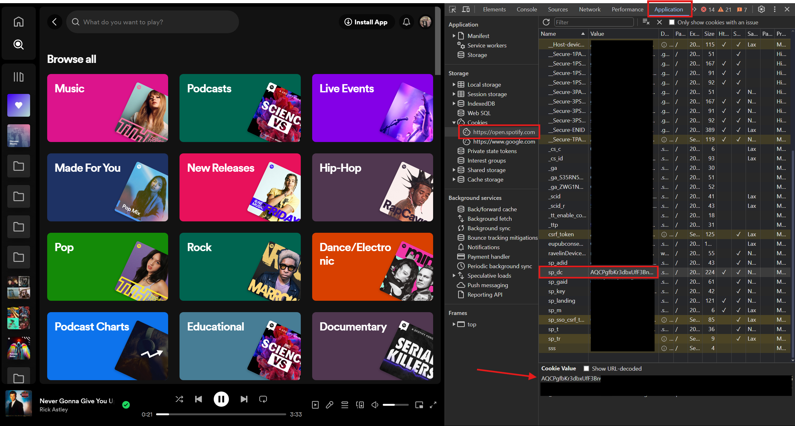

# Listen Along

## About

A simple web app to that allows you to listen to your friends on Spotify. This works for all your followed users who share their spotify activity. You just need to supply it with your `sp_dc` cookie from your browser which should last a year.



## How to run

1. Clone the repository

```bash
git clone https://github.com/Fidasek009/listen-along.git
```

2. Find your `sp_dc` cookie



3. Put the cookie into the `docker-compose.yaml` file

```yaml
# ...
    volumes:
      - ./backend:/usr/src/app
    environment:
      - SP_DC_COOKIE="<put your cookie here>" # <-- IMPORTANT

  frontend:
# ...
```

4. Run the app

```bash
cd listen-along
docker-compose up -d
```
